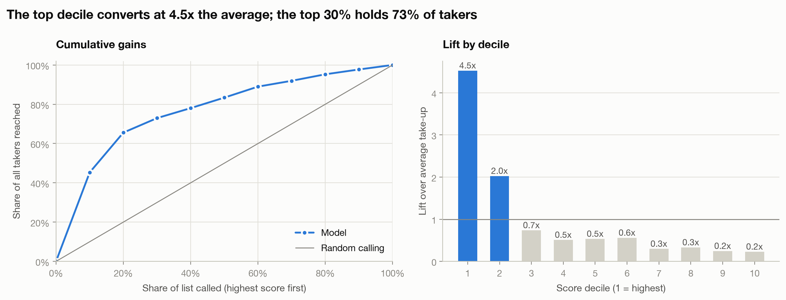
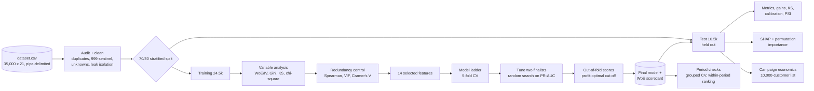
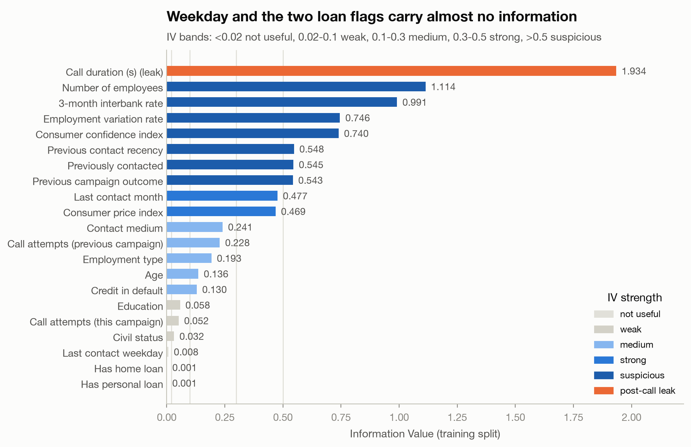
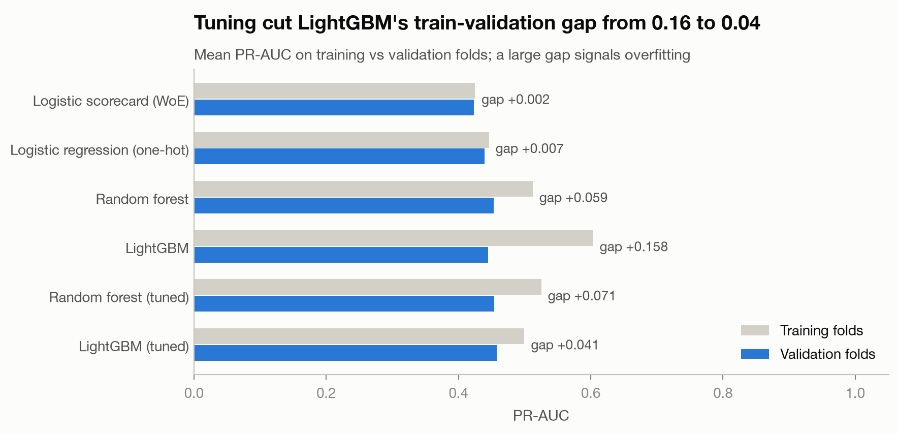
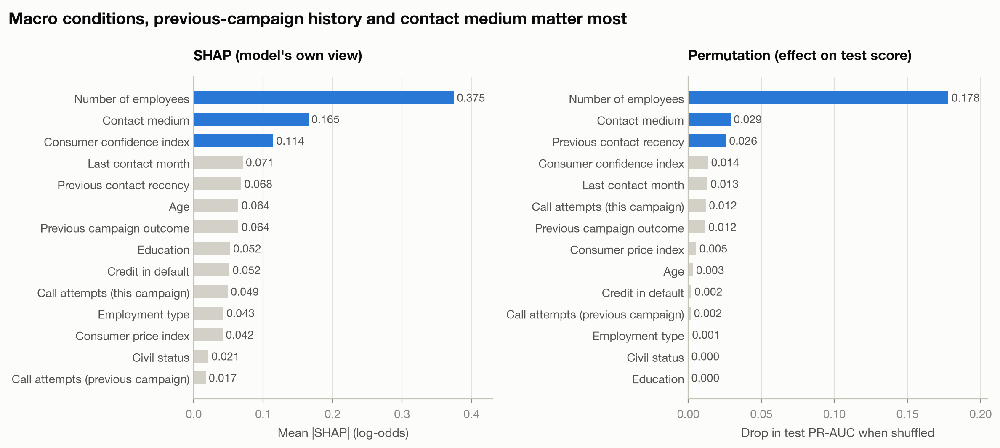
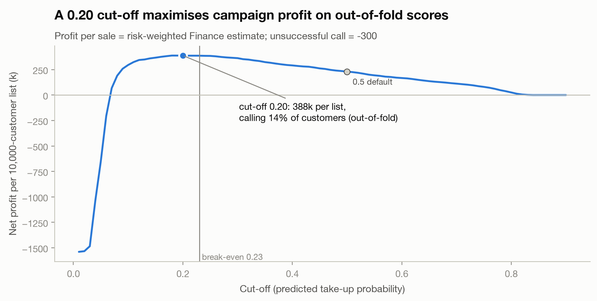
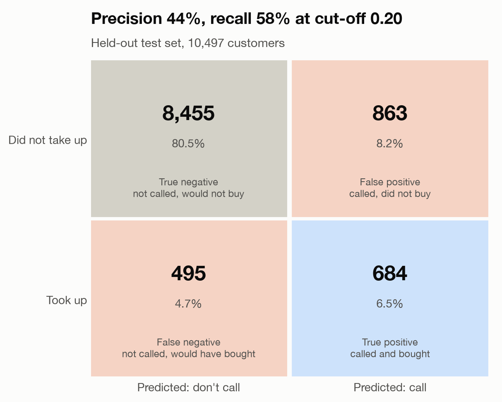
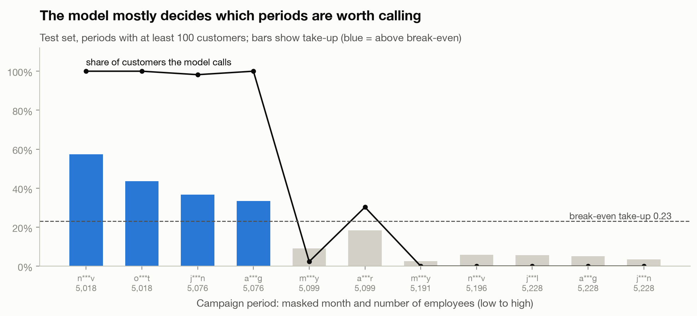

# Campaign Response Model

A model that ranks customers by how likely they are to **take up an offer when cold-called**, plus a profit overlay that turns its predictions into expected campaign returns. The goal is to call the right customers: spend call-centre effort where it converts, and skip calls that only cost money.

| | |
|---|---|
| **Data** | 35,000 customer contacts, 20 features (10 numeric, 10 categorical), 11.2% take-up |
| **Model** | Tuned LightGBM in a leakage-safe scikit-learn pipeline, chosen from a six-model ladder |
| **Held-out test (10,497 customers)** | PR-AUC **0.468** (base rate 0.112), ROC-AUC **0.810** (Gini 0.62), KS **0.52**, Brier **0.077** |
| **Targeting power** | The top 10% of scores take up at **4.5×** the average; the top 30% contain **73%** of all takers |
| **At the profit-optimal cut-off (0.20)** | Call **14.7%** of the list; precision **44%**, recall **58%** |
| **10,000-customer campaign** | Expected net profit **≈ 406k**, against **≈ −1.54M** for calling everyone; missed opportunity ≈ 719k |
| **Stability** | PSI between training and test scores: **0.005** |
| **Unseen campaign periods** | Holding out whole periods: ROC-AUC **0.72**, top-10% lift **2.9×**. Ranking *within* one period is weak (ROC-AUC ≈ 0.55), so most of the value is in choosing **when** to call, not only **whom** |

> **Read this first.** The file has no dates, but the four macro indicators take one value combination per campaign period (26 periods, one contact month each). A random split therefore tests the model on periods it has already seen. The headline numbers above answer the brief's question on that basis; [Campaign periods](#campaign-periods-when-versus-whom) shows what holds for a new period.

<p align="center"></p>

---

## Contents

1. [Workflow](#workflow)
2. [Quick start](#quick-start)
3. [Repository layout](#repository-layout)
4. [Design questions and answers](#design-questions-and-answers)
5. [Results](#results)
6. [Campaign periods: when versus whom](#campaign-periods-when-versus-whom)
7. [Campaign economics](#campaign-economics)
8. [Recommendations](#recommendations)
9. [What to check in an in-house response model](#what-to-check-in-an-in-house-response-model)
10. [Limitations and next steps](#limitations-and-next-steps)
11. [Testing](#testing)

---

## Workflow



| Stage | Command | Code | Outputs |
|---|---|---|---|
| 1. Prepare | `make prepare` | [`cleaning.py`](src/campaign_response/cleaning.py), [`analysis.py`](src/campaign_response/analysis.py), [`eda.py`](src/campaign_response/eda.py) | `reports/audit_log.csv`, `information_value.csv`, `feature_decisions.csv`, `vif_*.csv`, `selected_features.json`, figures 01–09 |
| 2. Train | `make train` | [`features.py`](src/campaign_response/features.py), [`modeling.py`](src/campaign_response/modeling.py) | `models/response_model.joblib`, `reports/cv_summary.csv`, `tuning_results.csv`, `thresholds.json`, `learning_curve.csv`, `leakage_benchmark.csv` |
| 3. Figures | `make figures` | [`evaluation.py`](src/campaign_response/evaluation.py) | figures 10–14, `reports/cv_paired_differences.csv` |
| 4. Evaluate | `make evaluate` | [`evaluation.py`](src/campaign_response/evaluation.py), [`explain.py`](src/campaign_response/explain.py), [`economics.py`](src/campaign_response/economics.py) | `reports/test_metrics.json`, `gains_table.csv`, `shap_importance.csv`, `permutation_importance.csv`, `campaign_economics.csv`, `campaign_scenarios.json`, figures 15–21 |
| 5. Periods | `make periods` | [`periods.py`](src/campaign_response/periods.py) | `reports/period_validation.csv`, `period_breakdown.csv`, `period_summary.json`, figure 22 |
| All | `make pipeline` | [`pipeline.py`](src/campaign_response/pipeline.py) | everything |
| Walkthrough | `make notebook` | [`notebooks/campaign_response_walkthrough.ipynb`](notebooks/campaign_response_walkthrough.ipynb) | Every design question, answered in order |

## Quick start

```bash
make setup                      # .venv with pinned dependencies
cp /path/to/dataset.csv data/raw/dataset.csv
make pipeline                   # about 10 minutes on a laptop
make test
```

To score a new list, prepare it with the same cleaning step and apply the saved bundle:

```python
import joblib
from campaign_response.cleaning import clean
from campaign_response.config import load_config
from campaign_response.data import load_raw

cfg = load_config()
bundle = joblib.load("models/response_model.joblib")
prospects, _ = clean(load_raw("new_list.csv"), cfg["leakage_columns"])
prospects["take_up_probability"] = bundle["pipeline"].predict_proba(prospects[bundle["features"]])[:, 1]
prospects["call"] = prospects["take_up_probability"] >= bundle["threshold"]
```

## Repository layout

```
campaign-response-model/
├── config.yaml                     # split, CV, tuning, selection thresholds, campaign economics
├── Makefile
├── src/campaign_response/
│   ├── data.py                     # loader, readable column names from the data dictionary
│   ├── cleaning.py                 # audit log, duplicates, 999 sentinel, leak isolation
│   ├── analysis.py                 # WoE/IV, Gini, KS, chi-square, Cramer's V, VIF, feature selection
│   ├── features.py                 # capping, rare-level grouping, WoE encoder, one-hot pipelines
│   ├── modeling.py                 # model ladder, CV, tuning, learning/boosting curves, leakage benchmark
│   ├── evaluation.py               # metrics, gains, KS, PSI, profit curve, charts
│   ├── explain.py                  # SHAP, permutation importance, scorecard coefficients
│   ├── economics.py                # campaign profit and lost opportunity
│   ├── periods.py                  # campaign-period grouping, grouped CV, within-period ranking
│   ├── eda.py, plotting.py         # charts
│   └── pipeline.py                 # CLI entry point
├── notebooks/                      # executed walkthrough
├── scripts/build_notebook.py
├── tests/                          # pytest: preparation, encoders, selection, economics
├── data/README.md                  # data dictionary, issues found and how they are handled
├── docs/                           # literature review and references for the method choices
└── reports/                        # metrics and figures (committed)
```

The client dataset is **not** committed; see [`data/README.md`](data/README.md).

## Design questions and answers

**1. Are all input variables relevant?**
No. Six of the 20 candidates are removed, and each decision is recorded in [`feature_decisions.csv`](reports/feature_decisions.csv):
- **Call duration** is only known after the call (data leak).
- **Weekday, home loan and personal loan** have Information Value (IV) below 0.02.
- **Two macro indicators** are redundant with the number-of-employees indicator.
- **"Previously contacted"** duplicates the recency band.

**2. What does the data look like? Outliers or corrections?**
- No nulls.
- 11 exact duplicates, which are dropped.
- The value 999 in "days since previous campaign" is a code, not a number of days. It is replaced by a recency band.
- "Unknown" categories are kept, because they carry signal.
- Call attempts has a long tail (maximum 56, 99th percentile 14) and is capped. Age up to 98 is plausible and kept.

See [`data/README.md`](data/README.md) and figures 01–02.

**3. How is discriminating power checked?**
On the training split only:
- WoE and Information Value, using rule-of-thumb bands derived from Siddiqi;
- univariate Gini;
- Kolmogorov-Smirnov (KS) for numeric variables;
- chi-square and Cramér's V for categorical variables.



**4. How are high correlations controlled?**
- **Numeric variables:** Spearman correlation above 0.85 means redundant; the variable with the highest IV is kept. Variance inflation factors (VIFs) fall from 64 before selection to 1.8 after, and the pipeline fails if any VIF exceeds 10.
- **Categorical variables:** bias-corrected Cramér's V above 0.8 means redundant.

**5. Does class balance matter?**
Take-up is 11%, but the data is not resampled. Resampling distorts probabilities, and the profit cut-off needs calibrated probabilities. Imbalance is handled by the choice of metrics (PR-AUC, lift, KS, profit) and by the cut-off.

**6. Different scales?**
- **Logistic models:** yes, scale matters. The one-hot model standardises numeric inputs, and the scorecard puts every input on the WoE log-odds scale.
- **Tree models:** scale does not matter.

**7. Encoding and grouping of categories?**
- **Encoding:** WoE for the scorecard, one-hot for the other models.
- **Grouping:** levels below 1% of training rows are merged into "Other (rare)", for example `credit_in_default = yes` (3 rows) and one education level (17 rows).
- Everything is learned inside the training folds.

**8. Bin numeric data?**
- **For the scorecard, yes:** decile bins let a linear model capture non-monotonic effects. Age, for instance, is U-shaped (figure 06).
- **For tree models, no:** they find their own split points.

**9. Split for training and testing?**
Yes: 70/30, stratified on the response. The test set is scored once, at the end.

**10. Validation checks during training?**
- Five-fold stratified cross-validation (CV) for every model, with preprocessing re-fitted inside each fold.
- Three-fold CV for tuning.
- Out-of-fold scores for choosing the cut-off.
- Grouped CV that holds out whole campaign periods, to check what carries over to a new period (see [Campaign periods](#campaign-periods-when-versus-whom)).

**11. How is the best model chosen (at least one non-linear)?**
A six-model ladder is ranked on CV PR-AUC, with Gini, KS, top-decile lift and Brier score also reported:
1. baseline;
2. business rule;
3. WoE scorecard;
4. one-hot logistic regression;
5. **random forest**;
6. **LightGBM**.

| Model | CV PR-AUC | CV Gini | CV KS | Top-10% lift | Train–validation gap |
|---|---:|---:|---:|---:|---:|
| Baseline (response rate) | 0.112 | 0.000 | 0.000 | 0.97 | 0.000 |
| Business rule (previous outcome) | 0.255 | 0.348 | 0.231 | 2.69 | −0.001 |
| Logistic scorecard (WoE) | 0.423 | 0.566 | 0.481 | 4.20 | 0.002 |
| Logistic regression (one-hot) | 0.439 | 0.561 | 0.478 | 4.29 | 0.007 |
| Random forest | 0.453 | 0.568 | 0.485 | 4.38 | 0.059 |
| LightGBM | 0.445 | 0.557 | 0.481 | 4.37 | 0.158 |
| Random forest (tuned) | 0.454 | 0.574 | 0.486 | 4.41 | 0.071 |
| **LightGBM (tuned)** | **0.458** | **0.577** | **0.488** | **4.44** | **0.041** |

**12. Which models are optimised, and how?**
The two best untuned models (random forest and LightGBM) are both tuned, because their scores were within 0.01 of each other. Each gets a randomised search over 25 candidates, scored by 3-fold PR-AUC:
- Random search suits a mixed parameter space with only a few important parameters (Bergstra & Bengio, 2012).
- PR-AUC rewards a clean top of the call list.

The tuned LightGBM is selected, but the non-linear models effectively tie. Comparing models on the same folds ([`cv_paired_differences.csv`](reports/cv_paired_differences.csv)), it beats the tuned forest by only +0.004 PR-AUC (4 of 5 folds) and one-hot logistic regression by +0.019 (5 of 5). Tuning reuses the training folds rather than a nested CV, so its small gains (+0.013 for LightGBM) may be slightly optimistic. LightGBM is kept because it has the smallest train–validation gap of the non-linear models, a boosting curve that shows no overfitting, and fast scoring. Its settings are 13 leaves, learning rate 0.010, 508 trees, at least 22 samples per leaf, 77% row and 82% column subsampling, L2 penalty 1.84.

**13. How is over- or underfitting avoided?**
- Tuning cut LightGBM's train–validation PR-AUC gap from 0.16 to 0.04.
- The learning curve shows validation PR-AUC plateauing at 0.46 while the gap narrows.
- On the boosting curve, validation loss flattens (lowest at round 408 of 508) instead of rising.
- Test PR-AUC (0.468) is in line with CV (0.458).
- Score PSI is 0.005.



**14. Most and least important variables? How are predictors interpreted?**
- **Most important:** the number-of-employees macro indicator, contact medium, consumer confidence, previous-contact recency, contact month and previous outcome. SHAP and permutation importance agree on this.
- **Least important:** education, civil status and employment type. Shuffling them changes test PR-AUC by less than 0.001.
- **Direction of effects (SHAP):** take-up is higher when:
  - the employment indicator is low;
  - the customer is contacted on the medium coded `Cat_0_c***r`;
  - there was recent prior contact;
  - a previous offer succeeded.
  
  Many call attempts in the current campaign lower take-up.



**15. How is the cut-off chosen?**
From economics, not from the default 0.5:
- A take-up is worth 1,001 on average: 0.10 × 285 + 0.25 × 705 + 0.65 × 1,225.
- A call that does not convert costs 300.
- The break-even probability is therefore 300 / 1,301 = 0.23 (Elkan, 2001).
- The cut-off that maximises profit on out-of-fold training scores is **0.20**, which is used.
- The profit curve is flat near the optimum: 388.3k at 0.20 against 386.4k at the 0.23 break-even (out-of-fold, per 10,000 customers). Any cut-off from about 0.18 to 0.23 is effectively as good. The F1-optimal cut-off (0.204) happens to land in the same place.

At 0.5 the model would call only 4.6% of customers and reach 26% of takers.



**16. How to read the confusion matrix?**
On the 10,497 test customers at a 0.20 cut-off, the model calls 1,547:
- **684 take up** (true positives): 44% precision, and 58% of all takers reached.
- **863 do not** (false positives): wasted calls.
- **495 takers are not called** (false negatives): missed sales.
- **8,455 non-takers are correctly skipped** (true negatives).

The model trades some missed takers for avoiding about 91% of pointless calls.



## Results

| Test metric | LightGBM (tuned) | WoE scorecard |
|---|---:|---:|
| PR-AUC | 0.468 | 0.436 |
| ROC-AUC / Gini | 0.810 / 0.620 | 0.800 / 0.601 |
| KS | 0.515 | 0.504 |
| Top-10% lift | 4.53 | 4.22 |
| Brier | 0.077 | 0.079 |

The WoE scorecard is about 0.03 PR-AUC below the tuned LightGBM (0.032 on test, 0.035 in CV) and is fully transparent. It is a reasonable challenger if interpretability matters more than the last few points of lift.

**Leakage check.** Adding call duration raises CV PR-AUC from 0.445 to 0.641. A model with that field would look far better on paper but could not be used before calling.

## Campaign periods: when versus whom

The four macro indicators take exactly one value combination per campaign period: 26 periods, each with a single contact month ([`period_summary.json`](reports/period_summary.json)). A campaign list is called within one period, so two extra checks are run ([`period_validation.csv`](reports/period_validation.csv)):

| Model | Check | ROC-AUC | PR-AUC | Top-10% lift | Within-period ROC-AUC | Within-period top-10% lift |
|---|---|---:|---:|---:|---:|---:|
| LightGBM (tuned) | Random split, test (seen periods) | 0.810 | 0.468 | 4.53 | 0.54 | 1.16 |
| LightGBM (tuned) | Grouped CV (unseen periods) | 0.722 | 0.339 | 2.91 | 0.56 | 1.53 |
| Customer-only LightGBM (no macro or month inputs) | Random split, test | 0.744 | 0.367 | 3.69 | 0.53 | 1.27 |
| Customer-only LightGBM | Grouped CV (unseen periods) | 0.718 | 0.355 | 3.49 | 0.55 | 1.41 |

Within-period figures are weighted means over periods with at least 10 takers and 10 non-takers.

**What this means.**
- **Most of the lift comes from timing.** Take-up is 33–60% in some periods and 2–6% in others. At the 0.20 cut-off, the model calls almost everyone in the high periods and almost no one in the low ones (figure 22, [`period_breakdown.csv`](reports/period_breakdown.csv)).
- **Customer ranking within a period is modest** (ROC-AUC ≈ 0.55, top-decile lift 1.2–1.5×). It still pays in mixed periods. In the period with 18% take-up, the model earns ≈ +461k per 10,000 customers by calling 30% of them, where calling everyone would lose ≈ 600k. In the period with 9% take-up it avoids a ≈ 1.8M loss.
- **On unseen periods**, pooled ROC-AUC is 0.72 rather than 0.81. The customer-only model does as well there (PR-AUC 0.355 against 0.339), so the macro inputs do not help with a period the model has never seen. They are still known before calling and are useful for deciding whether a campaign is worth running at all.
- **The economics below** follow the brief's assumption that the new list has the same confusion-matrix rates as the test sample. That holds only if the list is drawn from the same mix of periods. A list called in a single low-take-up period would produce few calls and little profit; one called in a high period would produce many.



## Campaign economics

**Assumptions:**
- The list of 10,000 customers has the same confusion-matrix percentages as the model's sample. The headline uses the test sample, the one sample the model never saw. The development (training) sample's out-of-fold rates are shown alongside ([`campaign_economics_development.csv`](reports/campaign_economics_development.csv)); the two agree to within about 5%.
- Everyone called qualifies.
- The risk-band mix (10% High, 25% Medium, 65% Low) applies equally to takers and non-takers.
- A customer who is not called generates neither profit nor cost.
- The per-sale profits (285, 705, 1,225) are already net of the call cost, so the 300 is charged only when the customer does not take up.

| Risk band | Called, take up | Called, no take-up | Missed takers | Net profit from calls | Missed profit | Wasted call cost |
|---|---:|---:|---:|---:|---:|---:|
| High (10%) | 65 | 82 | 47 | −6,093 | 13,440 | 24,664 |
| Medium (25%) | 163 | 206 | 118 | 53,187 | 83,113 | 61,660 |
| Low (65%) | 424 | 534 | 307 | 358,531 | 375,482 | 160,317 |
| **Total** | **652** | **822** | **472** | **405,624** | **472,035** | **246,642** |

**(a) Expected net profit** from calling the 1,474 customers the model selects is **≈ 405,600**.

**(b) Lost opportunity from misclassification** is **≈ 718,700**. It is the gap between perfect targeting (1,124,300) and this model, made up of:
- 472,000 in missed takers (false negatives);
- 246,600 spent on calls that did not convert (false positives).

If "lost opportunity" is read narrowly as sales the model failed to call, the answer is the first component alone: ≈ 472,000.

**How the numbers are built.** For each band *b* with list share *s_b* and per-sale profit *v_b*, and confusion-matrix rates *r* scaled to 10,000 customers:
- called takers = 10,000 × *r_TP* × *s_b* (likewise for the other three cells);
- (a) net profit = Σ_b (called takers_b × *v_b*) − 300 × called non-takers;
- (b) lost opportunity = Σ_b (missed takers_b × *v_b*) + 300 × called non-takers, which equals perfect-targeting profit minus (a).

**Test sample vs development sample.**

| Sample | Customers called | Sales | (a) Net profit | (b) Lost opportunity | of which missed sales | of which wasted calls |
|---|---:|---:|---:|---:|---:|---:|
| Test (headline) | 1,474 | 652 | 405,624 | 718,677 | 472,035 | 246,642 |
| Development (out-of-fold) | 1,409 | 623 | 388,301 | 735,637 | 499,846 | 235,791 |

**Context.**
- Calling all 10,000 customers would lose ≈ 1,538,700, so the model is worth ≈ 1.94M relative to calling everyone.
- It captures 36% of the perfect-targeting profit.
- The High band loses money at the single cut-off (−6,093), because a sale there earns less than a failed call costs. Break-even cut-offs per band (High 0.51, Medium 0.30, Low 0.20) would lift profit to ≈ 422,300 while making 1,300 calls instead of 1,474 ([`campaign_band_cutoffs.csv`](reports/campaign_band_cutoffs.csv)).

## Recommendations

1. **Call the top of the list first.** At the 0.20 cut-off (about 15% of a list), the team reaches 58% of takers with 44% precision.
2. **Apply risk-band-specific cut-offs** once the risk team's band is available per customer. In particular, call High-risk customers only when the predicted take-up probability is above 0.51.
3. **Decide when to run a campaign before deciding whom to call.** In this file, every period with the employment indicator at or below about 5,080 had take-up of 34% or more, well above the 23% break-even. Every sizeable period at 5,190 or above had take-up of 6% or less. In those periods, the model calls almost no one, and a broad campaign would lose money. Refresh the macro inputs for each campaign, monitor score PSI, and re-fit when PSI exceeds 0.1.
4. **Prefer the contact medium coded `Cat_0_c***r`** (probably "cellular"; take-up 14.7% against 5.2% for the other medium).
5. **Stop after four attempts.** Take-up is 13% on the first attempt and about 6% from the fifth attempt onwards.
6. **Keep call duration out of targeting models.** It is only available after the call.
7. **Keep the WoE scorecard as a challenger** and for explaining decisions to Sales and Risk.

## What to check in an in-house response model

These are the issues this data makes easy to get wrong. The 999 and resampling choices were tested against the alternative ([`sensitivity_checks.csv`](reports/sensitivity_checks.csv), `make sensitivity`).

| Check | Why it matters here |
|---|---|
| Is call duration an input? | It is only known after the call. Including it raises CV PR-AUC from 0.445 to 0.641 on paper, but the model cannot be used before dialling. |
| Is validation done on unseen campaign periods? | A random split re-uses the same periods; pooled ROC-AUC falls from 0.81 to 0.72 on held-out periods. |
| Is the 999 "never contacted" code treated as a number? | It should be a category. Here the mistake costs almost nothing: every model's PR-AUC moves by 0.004 or less. Trees split 999 off cleanly, and the "nonexistent" previous outcome carries the same flag. It still breaks averages (mean ≈ 960 days against a true 6), correlations and any rule based on days. |
| Was the data resampled to balance the classes? | Ranking barely changes (test PR-AUC 0.462 against 0.468), but the average score rises from 0.11 to 0.39 and the Brier score doubles. At the 0.20 cut-off the model would then call 97% of the list and lose ≈ 1.46M instead of earning ≈ 406k. |
| How was the cut-off chosen? | 0.5 calls 4.6% of the list; the profit-based cut-off (≈ 0.20) calls about 15% and earns more. |
| Are preprocessing and feature selection fitted on training data only? | Otherwise test results are optimistic. |

## Limitations and next steps

- **No time stamp, but periods are recoverable.** The file has no date, but the macro indicators identify 26 campaign periods. Grouped CV over these periods is included. A strict forward-in-time test is not possible, because the order of the periods is unknown.
- **Weak ranking within a period.** Customer inputs separate takers from non-takers only modestly inside one period (ROC-AUC ≈ 0.55). Better customer data (product holdings, tenure, past responses) would be the main lever.
- **No nested CV for tuning.** The tuning gains are small and within fold-to-fold noise.
- **Assumption behind the band profits.** The profit overlay assumes the risk band is independent of take-up. The risk team's customer-level band would allow a joint model.
- **Masked labels.** Category labels are masked, so interpretations are limited to the codes, apart from the "unknown" category.
- **Next steps:**
  - uplift modelling (who takes up *because* of the call);
  - customer-level risk bands in the objective;
  - probability recalibration if a new campaign's base rate shifts;
  - an out-of-time validation once dated campaigns are available;
  - a two-stage design: a period-level forecast of take-up to decide campaign timing and volume, and a customer model trained within periods to rank the list.

## Testing

```bash
make test
```

The tests cover:
- column mapping, deduplication and sentinel decoding;
- keeping the leaky field out of the features;
- WoE/IV values against a worked example;
- Cramér's V, and the feature-selection rules;
- that transformers learn only from training data;
- KS, lift and PSI;
- the campaign-economics formulas, checked against hand calculations;
- the per-band cut-offs;
- campaign-period grouping and within-period metrics;
- paired per-fold model differences.

## References

See [`docs/literature_review.md`](docs/literature_review.md) for the sources behind each method choice, including Moro, Cortez & Rita (2014), Siddiqi (2006), Elkan (2001), Saito & Rehmsmeier (2015), Bergstra & Bengio (2012) and Lundberg & Lee (2017).
